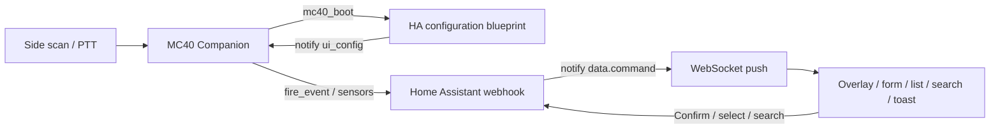

# Architecture

The APK is a lean API 22 companion: XML UI, AppCompat, OkHttp, a foreground service, and DataWedge intents. No Compose, no WebView Lovelace, no Play Services, no libsodium.

## Process

| Component | Role |
|-----------|------|
| `MainActivity` | Setup + init progress + dynamic scanner UI, overlay/form/list/search, quantity, hardware keys, LED bar |
| `CompanionService` | Foreground service: boot/config handshake, sensors, notify socket, scan/button/proximity publish, beep/vibrate/LED |
| `ScanReceiver` | Broadcast `dev.pantherale0.mc40.SCAN` and DataWedge result intents |
| `NotifySocket` | HA websocket `mobile_app/push_notification_channel` |
| `HaApi` | `GET /api/config`, `POST /api/mobile_app/registrations`, webhook POST |
| `SensorPublisher` | `register_sensor`, `update_sensor_states`, `fire_event` |
| `DataWedgeManager` | Profile **MC40HA**, soft scan, switch-to-profile |
| `OverlayParser` / `OverlayBus` | Notify `data.command` → UI + `FeedbackPlayer` |
| `UiConfigParser` / `UiConfigWriter` / `UiConfigBus` | Validate schema 1–3, persist last config, keep home config state |
| `ProximityMonitor` | `close` / `far` |
| `IdlePowerController` | `SCREEN_OFF` / `SCREEN_ON`: close notify socket, 10-minute wakeup alarm for diagnostics |

In-process buses (`ScanBus`, `OverlayBus`, `ModeBus`, `ButtonBus`) hop to the main thread. HTTP runs on the service executor.

## Initialization path

1. Registration starts the foreground service and welcome/progress screen.
2. Sensors register and the local-push WebSocket subscribes.
3. The service fires `mc40_boot` with `step: start`, then `timeout` every 10 seconds.
4. The required HA blueprint sends notify `command: ui_config`.
5. The app validates one to four slots (optional actions or schema 3 pages/widgets), selects the configured default if needed, renders the home screen, persists the config to SharedPreferences, and fires `mc40_boot` with `step: complete` once. The blueprint ignores `complete` so live re-pushes cannot loop.

On a later process start, a valid cached `ui_config` is restored immediately (scans and home UI work without waiting on HA). When the notify socket subscribes, the app fires a one-shot soft `mc40_boot` `step: start` (no timeout loop) so HA can refresh the cache. Notify `command: reinit` or unregister clears the cache and repeats a full handshake. Until ready (no cache and no HA reply), scan publication and product overlays are gated. The notify socket is kept alive even if the screen turns off while configuration is required.

## Scan path

1. DataWedge decode → intent extra **or** keystroke into hidden `wedgeCapture`
2. `ScanBus` (debounced) → UI shows last barcode; service `publishScan`
3. Webhook: update `last_barcode` + event `mc40_barcode_scanned` (`mode` included)
4. HA automation may `notify` overlay / form / list / search / toast / feedback
5. Confirm → `mc40_mode_confirm` (includes `mode` slot ID); form/list/search → `mc40_form_*` / `mc40_list_*` / `mc40_search`

Setup scans (unregistered or “Scan token QR”) fill URL/token instead of firing grocery events.

## Notify path

WebSocket `event` payload is parsed on the socket thread. Recognised `data.command` values are posted on `OverlayBus` (main thread). Unknown notifies become a Toast. Once initialized, the socket is closed on `SCREEN_OFF` and reopened on `SCREEN_ON` (or briefly after a scan/PTT).

## Constraints (do not regress)

- `targetSdk` 22
- DataWedge only for barcodes (no EMDK barcode APIs)
- Long-lived token only
- Keep RAM and layout on a 4.3" WVGA, 1 GB device
