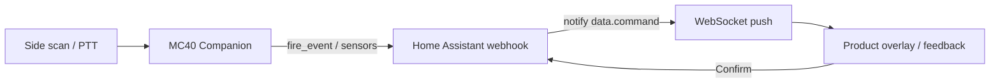

# Architecture

The APK is a lean API 22 companion: XML UI, AppCompat, OkHttp, a foreground service, and DataWedge intents. No Compose, no WebView Lovelace, no Play Services, no libsodium.

## Process

| Component | Role |
|-----------|------|
| `MainActivity` | Setup + scanner UI, overlay, quantity, hardware keys, LED bar |
| `CompanionService` | Foreground service: sensors, notify socket (dropped while screen off), scan/button/proximity publish, beep/vibrate/LED |
| `ScanReceiver` | Broadcast `dev.pantherale0.mc40.SCAN` and DataWedge result intents |
| `NotifySocket` | HA websocket `mobile_app/push_notification_channel` |
| `HaApi` | `GET /api/config`, `POST /api/mobile_app/registrations`, webhook POST |
| `SensorPublisher` | `register_sensor`, `update_sensor_states`, `fire_event` |
| `DataWedgeManager` | Profile **MC40HA**, soft scan, switch-to-profile |
| `OverlayParser` / `OverlayBus` | Notify `data.command` → UI + `FeedbackPlayer` |
| `ProximityMonitor` | `close` / `far` |
| `IdlePowerController` | `SCREEN_OFF` / `SCREEN_ON`: close notify socket, 10-minute wakeup alarm for diagnostics |

In-process buses (`ScanBus`, `OverlayBus`, `ModeBus`, `ButtonBus`) hop to the main thread. HTTP runs on the service executor.

## Scan path

1. DataWedge decode → intent extra **or** keystroke into hidden `wedgeCapture`
2. `ScanBus` (debounced) → UI shows last barcode; service `publishScan`
3. Webhook: update `last_barcode` + event `mc40_barcode_scanned` (`mode` included)
4. If mode is shopping: also `mc40_shopping_add` qty 1
5. HA automation may `notify` overlay / feedback
6. Confirm → `mc40_stock_adjust` or `mc40_shopping_add`

Setup scans (unregistered or “Scan token QR”) fill URL/token instead of firing grocery events.

## Notify path

WebSocket `event` payload is parsed on the socket thread. Recognised `data.command` values are posted on `OverlayBus` (main thread). Unknown notifies become a Toast. The socket is closed on `SCREEN_OFF` and reopened on `SCREEN_ON` (or briefly after a scan/PTT).

## Constraints (do not regress)

- `targetSdk` 22
- DataWedge only for barcodes (no EMDK barcode APIs)
- Long-lived token only
- Keep RAM and layout on a 4.3" WVGA, 1 GB device
